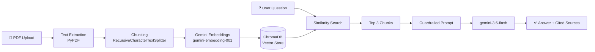

# 📚 Secure Enterprise RAG Assistant

**An end-to-end Retrieval-Augmented Generation (RAG) application that lets you upload a PDF and get grounded, citation-backed, hallucination-resistant answers — powered by Google Gemini, ChromaDB, and Streamlit.**

<p align="left">
  
  
  
  
  
</p>

---

## 📖 Table of Contents

- [Overview](#-overview)
- [Features](#-features)
- [How It Works](#-how-it-works)
- [Tech Stack](#-tech-stack)
- [Project Structure](#-project-structure)
- [Getting Started](#-getting-started)
  - [Prerequisites](#prerequisites)
  - [Installation](#installation)
  - [Configuration](#configuration)
  - [Running the App](#running-the-app)
- [Usage](#-usage)
- [Testing](#-testing)
- [Roadmap](#-roadmap)
- [License](#-license)

---

## 🔍 Overview

**Secure Enterprise RAG Assistant** is a document Q&A tool designed for scenarios where **accuracy and traceability matter more than creativity** — think internal policy docs, compliance manuals, or technical reports. Upload a PDF, ask a question in plain English, and the assistant retrieves the most relevant sections of the document and generates an answer **strictly grounded in that content**, citing exactly which chunk it pulled from.

If the answer isn't in the document, the assistant says so explicitly instead of guessing — no fabricated facts, no outside knowledge leaking into enterprise answers.

## ✨ Features

| Feature | Description |
|---|---|
| 🔎 **Semantic Search** | Document chunks are embedded with Gemini's `gemini-embedding-001` model for high-quality similarity retrieval. |
| 📄 **PDF Upload** | Upload any PDF directly through the Streamlit sidebar — no CLI or config files needed. |
| ✂️ **Smart Chunking** | `RecursiveCharacterTextSplitter` splits documents into 500-character chunks with 100-character overlap to preserve context across boundaries. |
| 🗄️ **In-Memory Vector Store** | ChromaDB indexes and stores embeddings for fast top-k retrieval within the session. |
| 🛡️ **Anti-Hallucination Guardrails** | A strict system prompt forces the model to answer *only* from retrieved context, and to explicitly decline when the answer isn't present. |
| 📌 **Source Citation** | Every claim is traceable — answers cite the originating chunk, e.g. `[Chunk 1]`. |
| 🎯 **Deterministic Output** | Generation runs at `temperature=0.0` for consistent, repeatable answers. |
| 💬 **Chat Interface** | Full conversational history with an expandable "View Retrieved Sources" panel per message. |

## ⚙️ How It Works



1. **Ingest** — The uploaded PDF is parsed page-by-page and its text extracted.
2. **Chunk** — Text is split into overlapping 500-character chunks to preserve semantic continuity.
3. **Embed & Store** — Each chunk is embedded via Gemini and stored in an in-memory ChromaDB collection alongside its source metadata.
4. **Retrieve** — On each question, the top 3 most semantically similar chunks are retrieved.
5. **Generate** — The retrieved chunks are injected into a guardrailed system prompt, and `gemini-3.6-flash` generates a deterministic, citation-backed answer.
6. **Cite** — The response and its supporting chunks are displayed together in the chat UI.

## 🛠️ Tech Stack

| Layer | Technology |
|---|---|
| UI / Frontend | [Streamlit](https://streamlit.io/) `1.32.0` |
| LLM & Embeddings | [Google Gemini](https://ai.google.dev/) (`google-genai` `0.3.0`) |
| Vector Database | [ChromaDB](https://www.trychroma.com/) `0.4.24` |
| PDF Parsing | [PyPDF](https://pypdf.readthedocs.io/) `4.1.0` |
| Text Chunking | [LangChain Text Splitters](https://python.langchain.com/) `0.0.1` |
| Config Management | [python-dotenv](https://pypi.org/project/python-dotenv/) `1.0.1` |
| Language | Python `3.11` |

## 📁 Project Structure

```text
Enterprise_RAG_App/
├── venv/              # Virtual environment (not tracked in Git)
├── app.py             # Main Streamlit application
├── requirements.txt   # Python dependencies
├── .env               # Local environment variables (not tracked in Git)
├── .gitignore
└── README.md
```

## 🚀 Getting Started

### Prerequisites

- Python 3.11 (or compatible)
- A [Google Gemini API key](https://ai.google.dev/)

### Installation

Clone the repository and set up a virtual environment (Windows):

```powershell
git clone <your-repo-url>
cd Enterprise_RAG_App

python -m venv venv
venv\Scripts\activate
```

Install the dependencies:

```powershell
pip install -r requirements.txt
```

### Configuration

Create a `.env` file in the project root and add your Gemini API key:

```env
GEMINI_API_KEY=your_actual_api_key_here
```

> ⚠️ **Never commit your `.env` file.** It's already excluded via `.gitignore`.

### Running the App

```powershell
streamlit run app.py
```

The app will open automatically at **<http://localhost:8501>**.

## 💡 Usage

1. Launch the app and upload a PDF document via the sidebar.
2. Wait for the "✅ Indexed N chunks successfully!" confirmation.
3. Ask a question about the document in the chat input.
4. Review the answer, and expand **"View Retrieved Sources"** to see exactly which chunks informed it.

## 🧪 Testing

| Scenario | Example Query | Expected Behavior |
|---|---|---|
| **In-scope question** | Ask something explicitly covered in the PDF | Returns a grounded answer with a citation, e.g. `[Chunk 2]` |
| **Out-of-scope question** | `Who won the World Cup in 2022?` | Responds: *"I cannot answer this based on the provided documents."* |
| **Ambiguous question** | `What is the policy?` | Uses the most relevant retrieved chunks and cites them accordingly |

## 🗺️ Roadmap

- [ ] Support for multi-document ingestion and cross-document retrieval
- [ ] Persistent vector storage (currently in-memory / session-scoped)
- [ ] Support for additional file formats (DOCX, TXT, HTML)
- [ ] Configurable chunk size / overlap / top-k via the UI
- [ ] Deployment guide (Docker / Streamlit Community Cloud)

## 📄 License

No license has been specified for this project yet. Consider adding one (e.g. [MIT](https://choosealicense.com/licenses/mit/)) if you plan to share or open-source it.

---

<p align="center">Built with ❤️ using Python, Streamlit, and Google Gemini</p>
